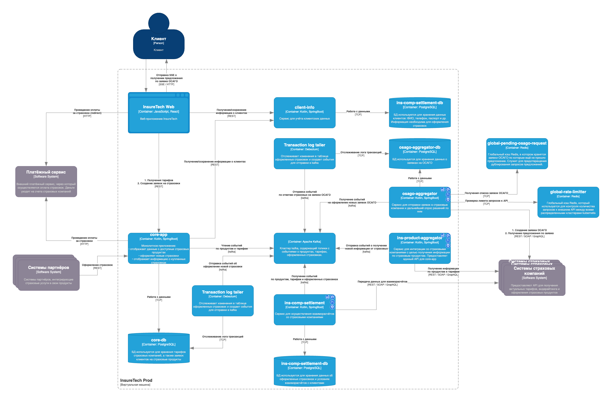

### Общее описание реализации оформления ОСАГО онлайн:
Создадим отдельный сервис `osago-aggregator`, который будет отвечать за взаимодействие с API страховых компаний. *(Предполагается, что API страховых поддерживает BULK запросы, 
чтобы была возможность создавать множество заявок одним запросом и так же получать информацию о решениях для множества заявок. 
В противном случае, с ростом количества пользователей, количество обращений к страховым может перегрузить их API, что сделает невозможным предоставление ответов пользователю в течение 60 секунд.)*
Этот сервис будет иметь локальную БД `osago-aggregator-db` для хранения поступивших заявок и ответов на них.
Сервис `osago-aggregator` будет получать сообщения о создании новых заявок ОСАГО от сервиса `core-app` через Kafka Event Streaming.
`osago-aggregator` создаёт заявку через API страховой и помещает информацию о заявке в глобальный кэш `global-pending-osago-request` для дальнейшей обработки.
После создания заявки, `osago-aggregator` будет посылать запросы к API страховой раз в 10 секунд, основываясь на данных в `global-pending-osago-request`. 
Это позволит удовлетворить требование о максимальном времени ответа клиенту в 60 секунд.
После получения ответа от страховой и сохранения его в локальную базу, Debezium создаст сообщение с деталями ответа и отправит его в kafka. В дальнейшем это сообщение будет обработано сервисом `core-app`
и пользователь будет уведомлен об ответе с помощью Server Sent Events.

---

### Предлагаемые решения по спорным вопросам:

1. **Требуется ли `osago-aggregator` своё хранилище данных?**
    - Да, требуется. Оно нужно для хранения информации о статусах заявок, логирования взаимодействий со страховыми компаниями и предотвращения дублирования запросов.
2. **Какой API `osago-aggregator` предоставляет `core-app`?**
    - API будет реализовано через Kafka Event Streaming:
        - `core-app` публикует событие с новой заявкой в Kafka.
        - `osago-aggregator` слушает события, обрабатывает их и отправляет запросы в страховые компании.
        - После получения решения страховой `osago-aggregator` публикует результат обратно в Kafka.
3. **Средство интеграции между `core-app` и `osago-aggregator`?**
    - Kafka Event Streaming, потому что:
        - Это снижает зависимость между сервисами.
        - Позволяет `osago-aggregator` обрабатывать заявки независимо и параллельно.
        - Упрощает масштабирование сервиса.
4. **API для веб-приложения в `core-app`?**
    - Остаётся REST API.
    - Добавляется SSE, для автоматической отправки информации о предложении страховой в браузер пользователя.
5. **Средство интеграции между веб-приложением и `core-app`?**
    - REST API + SSE.
6. **Нужны ли паттерны отказоустойчивости?:**

    Да:
    - Rate Limiting — для защиты API страховых компаний от перегрузок.
    - Circuit Breaker — если одна страховая компания недоступна, запросы к ней временно блокируются.
    - Retry — повторные попытки запроса к страховым компаниям в случае временных ошибок.
    - Timeout — если страховая компания не отвечает в течение 60 секунд, заявка считается просроченной.
    
    Подробнее остановимся на Rate Limiting. Так как у нас развернуты несколько кластеров kubernetes в различных регионах, необходимо учитывать общее количество запросов к API страховых от каждого кластера.
    Для этого предлагается использовать глобальный кэш Redis который будет вести подсчет общего количества запросов нашей системы к API страховых. В качестве алгоритма можно использовать Token Bucket.   
7. **Как влияет развертывание сервисов в нескольких экземплярах?**
    - Kafka обеспечит балансировку нагрузки между экземплярами `osago-aggregator`, так как разные инстансы могут обрабатывать события параллельно.
    - Глобальный кэш Redis `global-pending-osago-request` позволит избежать дублирования запросов о предложениях между всеми инстансами и кластерами с помощью распределенных блокировок. 
Перед началом опроса `osago-aggregator` повесит lock на все записи связанные, например, с определенным API и выполнит по ним запрос. Другие инстансы уже не будут использовать залоченные заявки.

---

### Обновленная диаграмма:

